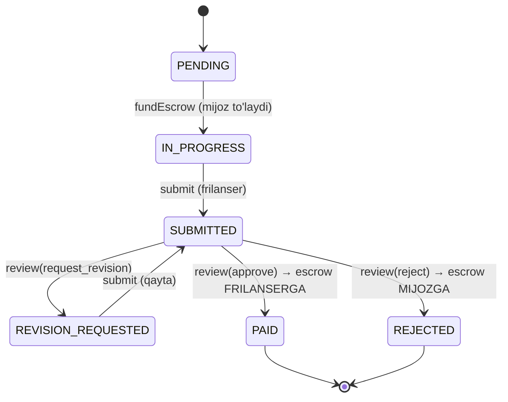

# 06 — Test strategiyasi (Testing Strategy)

> **Loyiha:** Nexus — Freelance & Agency Marketplace
> **Hujjat holati:** hozirgi holat — **o'lchangan fakt**. Test turlari va
> ustuvorliklar qat'iy; **vaqt va coverage raqamlari — maqsad**, birinchi o'lchovdan
> keyin tuzatiladi.

**Bog'liq:** [05-security.md](./05-security.md) — bu yerdagi testlar **aynan o'sha
topilmalarni** qulflaydi · [03-money-and-escrow.md](./03-money-and-escrow.md) ·
[04-data-model.md](./04-data-model.md) — **migratsiya yo'q** (kanon §3) ·
[07-roadmap.md](./07-roadmap.md)

---

## 1. ⚠️ Hozirgi holat — 0 test

```bash
find . -name '*.spec.*' -o -name '*.test.*' | grep -v node_modules | wc -l   # 0
```

| Backend | Modullar | Entity | Commit | **Testlar** |
|---|---|---|---|---|
| **9 633** qator | **15** | **25** | **25** | **0** |

Nol. Placeholder ham yo'q. ⚠️ **`package.json` da jest ham sozlanmagan** —
`mathacademy` dan farqi shu (u yerda "infratuzilma bor, test yo'q" edi). Bu yerda
**ikkalasi ham yo'q** — g'alati tarzda **yaxshiroq boshlanish**: yolg'on yashil test
yo'q, o'zini aldash yo'q. Toza nol.

### 1.1 Nima demak — aniq

"Har deploy — tekshirilmagan taxmin" juda umumiy. Aniqlashtiramiz: kanon §4 ikki
bagni yozadi, ikkalasi `d412913` da tuzatilgan:

1. `fundMilestone` — check-then-act poygasi → **balans manfiy**
2. `approveMilestone` — komissiya taqsimoti → **platforma pul yaratardi**

Ikkalasi ham **oylab kodda turgan**. Ikkalasini topgan narsa — **kodni o'qish**
(test yo'q edi). Va ikkalasi ham **testda darrov tutilar edi**:

- Poyga: ikkita parallel `fundEscrow` → balans manfiy → assert yiqiladi
- Taqsimot: `amount=0.05`, `fee%=10` → `fee + net !== amount` → assert yiqiladi

> **Bu — hujjatning butun asosi.** Test "yaxshi amaliyot" uchun emas: Nexus'da
> **allaqachon** ikkita pul bagi bo'lgan va test ularni **birinchi kunidayoq**
> ushlagan bo'lardi.

### 1.2 ⚠️ Va uchinchisi hali ham kodda

[05-security.md](./05-security.md) 13: `d412913` `fundEscrow` ni tuzatgan, lekin
**`payments.service.ts:102-141` `withdraw` da o'sha poyga qolgan** — bir xil naqsh,
bir xil oqibat.

Nega? Tuzatish **qo'lda**, qidiruv **qo'lda**. Testda boshqacha bo'lardi:

> Invariant `walletBalance >= 0` **butun tizim** uchun yozilsa, u `fundEscrow` da
> ham, `withdraw` da ham, kelajakdagi har debet yo'lida ham ishlaydi. **Bir marta
> yozasan — hammasini qamraydi.**

Shuning uchun 5-bo'lim testlari **endpoint** bo'yicha emas, **invariant** bo'yicha.

---

## 2. Nega Nexus uchun bu alohida yomon

### 2.1 Domen pul ko'chiradi

CRUD ilovada bag = noto'g'ri ko'rsatilgan ma'lumot. Nexus'da bag = **noto'g'ri joyga
ko'chgan pul**. Ko'rsatishni tuzatib sahifani yangilaysan; **ko'chgan pulni
qaytarish — migratsiya va hisob-kitob**.

⚠️ **Ha, pul soxta** ([05-security.md](./05-security.md) 1.1). Lekin escrow mantiqi
provayder ulangan kunga qadar **shu holatda** qoladi. Provayder ulash — bir kunlik
ish; buzilgan invariantni keyin topish — **allaqachon buzilgan ma'lumot** bilan ishlash.

### 2.2 Escrow — holat mashinasi



Har o'q — **pul ko'chishi yoki ko'chmasligi**. `SUBMITTED → PAID`
(`milestones.service.ts:255`) va `SUBMITTED → REJECTED` (`:174`) — escrow qarama-qarshi
tomonlarga, **ikkalasi ham bitta `review()` chaqirig'idan** (`:139-171`). Va aynan
shu yerda kanon §5 bagi: `else` → `rejectMilestone`, ya'ni **noma'lum kirish eng
buzg'unchi o'tishga olib keladi**.

> **Testsiz bu mashinani o'zgartirib bo'lmaydi.** Yangi holat qo'shsangiz (masalan
> `DISPUTED`), qaysi o'tish buzilganini **hech narsa aytmaydi**. Kod kompilyatsiya
> bo'ladi, sahifa ochiladi, pul noto'g'ri odamga ketadi.

### 2.3 ⚠️ Va bu refactoring rejalashtirilgan

Kanon §4: pul maydonlari `number` deb annotatsiya qilingan, runtime'da **string**.
To'g'ri yechim — 25 entity bo'ylab `string` yoki `ColumnNumericTransformer`
([03-money-and-escrow.md](./03-money-and-escrow.md)). Bu — **har pul maydoniga
tegish**. Hozir `bids.service.ts:237`, `milestones.service.ts:183`,
`contracts.service.ts:274` da float, `milestones.service.ts:317-318` da 2 ta
`as unknown as number`.

> **Testsiz bu — ko'r-ko'rona jarrohlik.** `Number(x)` ni olib tashlaganda
> bittasini buzsangiz **hech narsa ushlamaydi**: TypeScript jim (annotatsiya
> allaqachon yolg'on), ilova ishga tushadi, yaxlitlash xatosi **jimgina** paydo bo'ladi.

> **Escrow invariant testlari — [03-money-and-escrow.md](./03-money-and-escrow.md)
> dagi refactoringning OLD SHARTI, undan keyingi ish emas.**

Test refactoringda **ikki marta** ishlaydi: **oldin** — hozirgi kod bilan yashil
(aks holda bizda allaqachon bag bor); **keyin** — yana yashil (hech narsa
buzilmaganining yagona isboti).

---

## 3. Test piramidasi

| Qatlam | Ulush | Nishon vaqt | Qachon |
|--------|-------|-------------|--------|
| Unit | ~30% | < 15 s | Har save |
| **Integration** | **~65%** | < 5 daq | Har push |
| E2E | ~5% | < 3 daq | Har PR |

⚠️ **Vaqt raqamlari — maqsad, o'lchov emas.** Hozir 0 test bor. Birinchi 20 tadan
keyin qayta ko'riladi.

### 3.1 Nega integration 65% — asosiy qaror

> **Nexus mantiqining eng muhim qismi TypeORM tranzaksiyalarining ichida yashaydi.**

`contracts.service.ts:219-227` — `d412913` tuzatishi:

```ts
const debited: Array<{ walletBalance: string }> = await queryRunner.query(
  `UPDATE "users" SET "walletBalance" = "walletBalance" - $1::numeric,
                      "escrowBalance" = "escrowBalance" + $1::numeric
    WHERE "id" = $2 AND "walletBalance" >= $1::numeric
RETURNING "walletBalance"`, [milestone.amount, clientId]);
if (debited.length === 0) throw new BadRequestException('Insufficient wallet balance');
```

Bu kodning to'g'riligi **qayerda yashaydi**? TypeScript'da emas:
- PostgreSQL'ning `UPDATE ... WHERE` ni **qulflangan qator** bo'yicha baholashida
- `READ COMMITTED` izolyatsiyasida (kommentda **aniq yozilgan**, `:213`)
- `numeric` arifmetikasida · `RETURNING` ning 0 qator qaytarishida

**Bularning hech biri TypeScript'da yo'q. Ular DB'da.**

### 3.2 ⚠️ Mock qilingan repository HECH NARSA isbotlamaydi

Eng jozibador va eng zararli qisqa yo'l:

```typescript
// ❌ YOMON — bu testni YOZMANG. U yolg'on ishonch beradi.
const queryRunner = { query: jest.fn().mockResolvedValue([]) };   // 0 qator
await expect(service.fundEscrow('c1','m1','u1')).rejects.toThrow('Insufficient');
```

Test **o'tadi**. Va **hech narsani isbotlamaydi**:

**1. Mock poyga holatini ko'rsatmaydi** — hal qiluvchi sabab. `jest.fn()`
**ketma-ket** chaqiriladi; poyga esa — **ikki bir vaqtdagi tranzaksiya**ning
bir-birini ko'rishi. Mock'da "bir vaqtda" tushunchasi **yo'q**.

> **Mock bilan `d412913` tuzatgan bagni test qilish printsipial imkonsiz.** Bu
> tanlov emas, fakt.

**2. Mock `WHERE` ni tekshirmaydi.** `mockResolvedValue([])` **har qanday** SQL
uchun bir xil javob. Kimdir `AND "walletBalance" >= $1::numeric` ni **o'chirsa** —
test baribir o'tadi. Ya'ni **aynan qo'rqayotgan regressiyani** o'tkazadi.

**3. Mock `numeric` ni bilmaydi.** `milestones.service.ts:276-277` —
`round($1::numeric * $2::numeric / 100, 2)` — bu **Postgres'niki**. Kanon §4:
mustaqil yaxlitlash `$0.05` da bir tiyin **yaratgan**. Mock siz aytgan narsani
qaytaradi; real Postgres **haqiqatni**.

**4. Mock string/number yolg'onini yashiradi.** Kanon §4: TypeORM `decimal` ni
**string** qaytaradi; mock — odatda `number`. Test'da `number`, production'da
`string` → `bid.amount + fee` = `"100010"`. **Mock aynan o'sha yolg'onni takrorlaydi.**

**5. Mock tranzaksiya/rollback'ni bilmaydi** (`milestones.service.ts:256-258`,
`:174-180`, `contracts.service.ts:196-198`) → **yarim ko'chgan escrow holati hech
qachon sinalmaydi**.

**6. Mock `CHECK`/FK/unique'ni bilmaydi** — 25 entity, mock'da constraint yo'q.

> **Mock qilingan repository — DB haqidagi taxminlaringizni tekshiradi, DB'ni emas.
> Va aynan o'sha taxminlar noto'g'ri bo'ladi.**

### 3.3 Unit — faqat sof mantiq

| Nima | Qayerda |
|---|---|
| Holat o'tish jadvali | `contracts.service.ts:134-141` — `allowed: Record<...>` ✅ **sof ma'lumot** |
| `review` action → yo'nalish | Yangi: `domain/milestone-review.ts` |
| `generateSlug` · `getPagination` | `generate.util.ts:26` · `common/utils/pagination.util.ts` |

⚠️ **Fee hisobi haqida halol gap:** u **sof emas** — u `milestones.service.ts:274-279`
da **SQL so'rovi**. Ajratish uni `numeric` dan **olib chiqadi** va aynan o'sha bag
qaytadi.

> **Fee hisobi ataylab SQL'da qoldirilgan — bu TO'G'RI qaror.** Uning testi —
> **integration**. `numeric` yaxlitlashini JavaScript takrorlay olmaydi.

### 3.4 Mock siyosati

**Mock qilinadi:** `MailerService` (`auth.service.ts:91`), OAuth provayderlari.
**Mock QILINMAYDI:** PostgreSQL, TypeORM, o'z modullaringiz.

---

## 4. Testcontainers — real PostgreSQL

### 4.1 ⚠️ Halol muammo: migratsiya yo'q → test productionni tasdiqlamaydi

**Bu — butun strategiyaning chegarasi, uni yumshatmaymiz.**

Kanon §3: `find backend/src -ipath "*migration*" -name "*.ts" | wc -l` → **0**.
Config migratsiya katalogiga ishora qiladi — **katalog yo'q**.

`mathacademy` da Testcontainers `prisma migrate deploy` ni ishga tushirib
**migratsiyalarning o'zini ham** sinaydi. Nexus'da bunday qilib **bo'lmaydi**.

| Variant | Ishlaydi? | Muammo |
|---|---|---|
| `synchronize: true` test bazasida | ✅ Darhol | ⚠️ **Bu production sxemasi EMAS** |
| Migratsiya yozib `migration:run` | ✅ To'g'ri | Migratsiya yo'q — **katta ish** |

**Qaror: hozircha `synchronize: true`**, va u **ochiq yozilsin**:

> ⚠️ **Testlar `synchronize: true` bilan qurilgan sxemada ishlaydi — entity'lardan
> hosil qilingan sxema, production'dagi EMAS.** Yashil test **"kod entity'lariga
> mos"** deydi, **"kod production'da ishlaydi"** demaydi.

| Test tasdiqlaydi | Test tasdiqlamaydi |
|---|---|
| Escrow arifmetikasi `numeric` da to'g'ri | Production'da `numeric(10,2)` ekanini |
| Poyga shartli `UPDATE` bilan yopilgan | Production'da ustun **borligini** |
| IDOR tekshiruvlari ishlaydi | Sxema entity'larga **mos kelishini** |
| Holat o'tishlari to'g'ri | Migratsiya buzuq emasligini (**yo'q**) |

⚠️ **Bu nazariy xavf emas.** `auth.service.ts:227-240` da **allaqachon**:

```ts
try { await this.userRepo.increment({ id: user.id }, "loginCount", 1); }
catch (error) {
  if (code === "42703" || message.includes("login_count")) {
    // Ignore if the column is missing due to an out-of-date database schema.
  }
}
```

**`42703` — PostgreSQL'ning "ustun mavjud emas" xatosi.** Kod production sxemasi
entity'ga **mos kelmasligini biladi** va uni **jimgina yutadi**. Bu — drift'ning
**isboti**, taxmin emas.

⚠️ **Lekin bu testni kutishga sabab EMAS.** Escrow arifmetikasi va poyga sxemadan
**mustaqil** (ular `numeric` va qulflash haqida) — **bugun** yozilib bugun qiymat
beradi. Migratsiya qo'shilganda `synchronize: true` → `migration:run` ga almashadi
va **o'sha testlar kuchayadi**. Tartib migratsiyaga **bog'liq emas**.

### 4.2 Paketlar

```bash
npm i -D jest ts-jest @types/jest @nestjs/testing supertest @types/supertest
npm i -D @testcontainers/postgresql testcontainers fast-check
```

Redis konteyneri **kerak emas** (loyihada Redis yo'q).

### 4.3 Setup — to'liq kod

```typescript
// backend/test/setup/containers.ts
import { PostgreSqlContainer, StartedPostgreSqlContainer } from '@testcontainers/postgresql';

export interface TestInfra { postgres: StartedPostgreSqlContainer }

/**
 * Konteyner butun to'plam uchun BIR MARTA (globalSetup). Har faylda ko'tarish
 * sekin: ~3 s x fayl. Testlar orasidagi izolyatsiya — TRUNCATE bilan (4.5).
 */
export async function startInfra(): Promise<TestInfra> {
  // ⚠️ Versiya production bilan bir xil bo'lishi kerak.
  // OCHIQ SAVOL: Render'da PostgreSQL nechanchi versiya?
  const postgres = await new PostgreSqlContainer('postgres:15-alpine')
    .withDatabase('nexus_test').withUsername('nexus').withPassword('test')
    // Testda durablik kerak emas — tezlik kerak. Konteyner oxirida o'chadi.
    .withCommand(['postgres', '-c', 'fsync=off', '-c', 'full_page_writes=off',
                  '-c', 'synchronous_commit=off'])
    .start();
  return { postgres };
}
```

```typescript
// backend/test/setup/global-setup.ts
module.exports = async function globalSetup(): Promise<void> {
  const infra = await startInfra();
  const pg = infra.postgres;

  // database.config.ts DB_* ni o'qiydi — AppModule ko'tarilishidan OLDIN qo'yish shart.
  process.env.DB_HOST = pg.getHost();
  process.env.DB_PORT = String(pg.getMappedPort(5432));
  process.env.DB_USERNAME = pg.getUsername();
  process.env.DB_PASSWORD = pg.getPassword();
  process.env.DB_NAME = pg.getDatabase();

  // ⚠️ 'test' — 'production' EMAS → synchronize: true → sxema entity'lardan.
  // Bu 4.1 dagi ONGLI murosa. Migratsiya qo'shilgach bu yer o'zgaradi.
  process.env.NODE_ENV = 'test';

  // jwt.config.ts fallback'ga tushmasin (05-security 14.2).
  process.env.JWT_SECRET = 'test-jwt-secret-not-a-real-secret-00000000';
  process.env.JWT_REFRESH_SECRET = 'test-refresh-secret-not-real-00000000';

  (globalThis as any).__INFRA__ = infra;
};

// global-teardown.ts
module.exports = async function globalTeardown(): Promise<void> {
  await ((globalThis as any).__INFRA__ as TestInfra | undefined)?.postgres.stop();
};
```

### 4.4 Jest konfiguratsiyasi

`package.json` da jest bloki **umuman yo'q** — noldan yozamiz.

```javascript
// backend/test/jest-integration.json
{
  "moduleFileExtensions": ["js", "json", "ts"],
  "rootDir": "..",
  "testRegex": ".*\\.int-spec\\.ts$",
  "transform": { "^.+\\.(t|j)s$": "ts-jest" },
  "testEnvironment": "node",
  "globalSetup": "<rootDir>/test/setup/global-setup.ts",
  "globalTeardown": "<rootDir>/test/setup/global-teardown.ts",
  "setupFilesAfterEach": ["<rootDir>/test/setup/after-env.ts"],
  "testTimeout": 60000,
  "maxWorkers": 1
}
```

⚠️ **`maxWorkers: 1` — ataylab.** Bitta konteyner + `TRUNCATE`. Parallel worker'lar
bir-birining ma'lumotini o'chiradi. Keyin **har worker uchun alohida schema** —
lekin bu optimallashtirish, birinchi kunning ishi emas.
⚠️ **`testTimeout: 60000`** — konteyner + `synchronize` sekin.

```json
"test": "jest --config ./test/jest-unit.json",
"test:int": "jest --config ./test/jest-integration.json --runInBand"
```

⚠️ **Poyga testi uchun shart:** parallel `fundEscrow` uchun **kamida 2 ta bir vaqtda
ochiq ulanish** kerak. `database.config.ts` da `extra: { max: N }` tekshirilsin —
`1` bo'lsa poyga testi **deadlock** bo'ladi va u "test sekin" kabi ko'rinadi.
**Ochiq savol.**

### 4.5 Tozalash — nega TRUNCATE, rollback emas

| Usul | Qaror |
|------|-------|
| Har test uchun yangi konteyner | Yo'q — juda sekin (~3 s × N) |
| Tranzaksiya + rollback | Yo'q — **bu loyihada ishlamaydi** |
| `TRUNCATE ... CASCADE` | **Tanlandi** |

⚠️ **Nega rollback ishlamaydi:** servislarning **o'zi** `startTransaction()`
ishlatadi (`contracts.service.ts:198`, `milestones.service.ts:180`, `:258`,
`payments.service.ts:112`, `auth.service.ts:62`). Testni tranzaksiyaga o'rasak →
**ichma-ich** → savepoint → **izolyatsiya darajasi o'zgaradi**. Va bu **aynan biz
test qilayotgan narsani buzadi**: `contracts.service.ts:213` kommenti
`READ COMMITTED` ga **aniq tayanadi**. Savepoint ichida poyga xatti-harakati
**boshqacha** → rollback usuli poyga testini **ma'nosiz** qiladi.

```typescript
// backend/test/setup/db.ts
/**
 * 25 entity bor — ro'yxatni QO'LDA yozish yangi entity qo'shilganda unutiladigan
 * joy. Shuning uchun pg_tables dan O'QIYMIZ: yangi entity avtomatik qamraladi.
 */
export async function truncateAll(): Promise<void> {
  const rows: Array<{ tablename: string }> = await ds!.query(`
    SELECT tablename FROM pg_tables
    WHERE schemaname = 'public' AND tablename <> 'migrations'`);
  if (rows.length === 0) return;
  const tables = rows.map((r) => `"public"."${r.tablename}"`).join(', ');
  await ds!.query(`TRUNCATE TABLE ${tables} RESTART IDENTITY CASCADE`);
}

// after-env.ts — har testdan OLDIN tozalaymiz, keyin emas.
// Sabab: test yiqilganda ma'lumot DB'da qoladi va uni qo'lda ko'rish mumkin.
beforeEach(async () => { await truncateAll(); });
```

---

## 5. ⚠️ 1-USTUVORLIK: escrow invariantlari

### 5.1 Nega invariant, nega endpoint emas

"`fundEscrow` ni test qilamiz, keyin `approveMilestone` ni..." — **yetarli emas**,
va 1.2 buni ko'rsatdi: `withdraw` da poyga qoldi, chunki har endpoint **alohida**
o'ylandi. Invariant esa **tizim haqida** gapiradi:

| | Invariant |
|---|---|
| **I1** | `walletBalance >= 0` — **har doim, har yo'ldan keyin** |
| **I2** | `fee + net === amount` — **har doim, har summa uchun** |
| **I3** | `SUM(wallet) + SUM(escrow)` — escrow yopiq: pul **ko'chadi**, yaratilmaydi |
| **I4** | Holat mashinasi — noto'g'ri o'tish **rad etiladi** |

### 5.2 I1 — poyga regressiya testi

```typescript
// backend/test/escrow-invariants.int-spec.ts
describe('⚠️ ESCROW INVARIANTLARI — tizimning eng muhim testi', () => {
  let app: INestApplication;

  beforeAll(async () => {
    const moduleRef = await Test.createTestingModule({ imports: [AppModule] }).compile();
    app = moduleRef.createNestApplication();
    await app.init();
    setTestDataSource(app.get(DataSource));
  });
  afterAll(async () => { await app.close(); });

  /**
   * ⚠️ BU TEST `d412913` NING REGRESSIYA TESTI.
   *
   * Bag: balans tekshiruvi tranzaksiyadan TASHQARIDA va undan OLDIN edi, debet
   * shartsiz. Ikki bir vaqtdagi so'rov → ikkalasi o'tadi → balans manfiy, escrow
   * yo'q puldan to'ladi.
   *
   * Agar kimdir WHERE bandini olib tashlasa — BU TEST YIQILADI. Boshqa hech narsa
   * uni ushlamaydi.
   */
  it('parallel fundEscrow × 2 — FAQAT BITTASI o\'tadi', async () => {
    const f = makeFactories(testDataSource());
    // Mijozda ATIGI bitta milestone'ga yetadigan pul bor.
    const client = await f.user({ role: 'client', walletBalance: '100.00' });
    const freelancer = await f.user({ role: 'freelancer' });
    const contract = await f.contract(client.id, freelancer.id, { totalAmount: '200.00' });
    const m1 = await f.milestone(contract.id, { amount: '100.00' });
    const m2 = await f.milestone(contract.id, { amount: '100.00' });

    // ⚠️ ENG MUHIM QATOR: allSettled — ketma-ket EMAS, BIR VAQTDA.
    // `await x; await y;` qilsak poyga UMUMAN sinalmaydi.
    const results = await Promise.allSettled([
      app.get(ContractsService).fundEscrow(contract.id, m1.id, client.id),
      app.get(ContractsService).fundEscrow(contract.id, m2.id, client.id),
    ]);

    expect(results.filter((r) => r.status === 'fulfilled')).toHaveLength(1);
    expect(results.filter((r) => r.status === 'rejected')).toHaveLength(1);

    // ⚠️ VA ENG MUHIMI: DB holatini TEKSHIRAMIZ. Status to'g'ri bo'lib,
    // balans baribir buzilgan bo'lishi mumkin.
    const after = await testDataSource().getRepository(User).findOne({ where: { id: client.id } });
    expect(Number(after!.walletBalance)).toBe(0);
    expect(Number(after!.walletBalance)).toBeGreaterThanOrEqual(0);   // I1
    expect(Number(after!.escrowBalance)).toBe(100);
  });

  /**
   * ⚠️ XUDDI SHU TEST `withdraw` UCHUN — VA U HOZIR YIQILADI.
   * 05-security.md 13: payments.service.ts:105-115 da o'sha poyga qolgan.
   *
   * Bu testni AVVAL yozamiz, u YIQILADI, keyin tuzatamiz. Shu tartibda — aks
   * holda tuzatishning ishlaganini hech narsa isbotlamaydi.
   */
  it.failing('parallel withdraw × 2 — FAQAT BITTASI o\'tadi', async () => {
    const f = makeFactories(testDataSource());
    const user = await f.user({ role: 'freelancer', walletBalance: '100.00' });

    const results = await Promise.allSettled([
      app.get(PaymentsService).withdraw(user.id, 100, PaymentMethod.WALLET),
      app.get(PaymentsService).withdraw(user.id, 100, PaymentMethod.WALLET),
    ]);
    expect(results.filter((r) => r.status === 'fulfilled')).toHaveLength(1);

    const after = await testDataSource().getRepository(User).findOne({ where: { id: user.id } });
    expect(Number(after!.walletBalance)).toBeGreaterThanOrEqual(0);   // ← HOZIR -100
  });
});
```

⚠️ **`Promise.allSettled` — testning butun mohiyati.** `await a; await b;` yozsangiz
ular **ketma-ket** ishlaydi, poyga **sinalmaydi**, test yashil bo'ladi va **hech
narsani isbotlamaydi**. Bu fayldagi eng oson qilinadigan xato.

⚠️ **Halol eslatma:** ikki `Promise` bir event loop'da — bu **haqiqiy** parallellik
emas, lekin **ikki alohida DB ulanishi va tranzaksiya** yaratadi. Poyga DB
darajasida sodir bo'ladi → **yetarli**. Poyga testlari tabiatan nodeterministik —
ishonch uchun bir necha marta takrorlansin.

### 5.3 I2 — `fee + net === amount` (property test)

```typescript
/**
 * ⚠️ KANON §4, 2-BAG: fee va net MUSTAQIL hisoblanardi, ikkalasi ALOHIDA
 * yaxlitlanardi. $0.05 × 10% → fee 0.01, net 0.05, jami 0.06, escrow'dan 0.05
 * → PLATFORMA PUL YARATARDI.
 *
 * Tuzatish (milestones.service.ts:274-281): fee bir marta numeric da yaxlitlanadi,
 * net = amount - fee deb TA'RIFLANADI.
 *
 * Bu test bitta emas, MINGLAB tasodifiy misolni tekshiradi: $0.05 kabi burchak
 * holatini qo'lda o'ylab topish kerak emas — fast-check uni O'ZI topadi.
 */
describe('I2 — fee + net === amount (har doim)', () => {
  it('tasodifiy amount va feePercent uchun yig\'indi HAR DOIM teng', async () => {
    const ds = testDataSource();
    await fc.assert(fc.asyncProperty(
      fc.integer({ min: 1, max: 9_999_999_999 }),   // numeric(10,2) chegarasi, tiyinda
      fc.integer({ min: 0, max: 100 }),
      async (amountCents, feePercent) => {
        const amount = (amountCents / 100).toFixed(2);

        // ⚠️ Servisdagi AYNAN o'sha SQL. JS'da qayta yozsak, Postgres numeric
        // yaxlitlashini EMAS, o'z taxminimizni test qilamiz.
        const [split] = await ds.query(
          `SELECT round($1::numeric * $2::numeric / 100, 2) AS "platformFee",
                  $1::numeric - round($1::numeric * $2::numeric / 100, 2) AS "netAmount"`,
          [amount, feePercent]);

        const [check] = await ds.query(
          `SELECT ($1::numeric + $2::numeric = $3::numeric) AS ok`,
          [split.platformFee, split.netAmount, amount]);
        expect(check.ok).toBe(true);                            // INVARIANT
        expect(Number(split.platformFee)).toBeGreaterThanOrEqual(0);
        expect(Number(split.netAmount)).toBeGreaterThanOrEqual(0);
      }), { numRuns: 500 });
  });

  // Bag'ni TUG'DIRGAN aniq holat — alohida, nomlangan test.
  it('$0.05 × 10% — bag\'ning asl holati', async () => {
    const [split] = await testDataSource().query(
      `SELECT round($1::numeric * $2::numeric / 100, 2) AS "platformFee",
              $1::numeric - round($1::numeric * $2::numeric / 100, 2) AS "netAmount"`,
      ['0.05', 10]);
    expect(split.platformFee).toBe('0.01');
    expect(split.netAmount).toBe('0.04');            // ← eski kod 0.05 berardi
  });
});
```

⚠️ **Nega SQL'da, JS'da emas:** 3.3. `round()` — **Postgres'niki**. JS'da qayta
yozsak **boshqa funksiyani** test qilgan bo'lamiz. Test **kod ishlatadigan yo'lni**
ishlatishi kerak.

### 5.4 I3 — escrow yopiq tizim

```typescript
/**
 * Tizimdagi JAMI pul = SUM(walletBalance) + SUM(escrowBalance). Bu son FAQAT
 * deposit/withdraw da o'zgaradi. Escrow amallari (fund/approve/reject) — PUL
 * KO'CHISHI, jami O'ZGARMASLIGI SHART.
 *
 * ⚠️ Istisno: approveMilestone platforma komissiyasini oladi
 * (milestones.service.ts:325 — payeeId: 'platform') → foydalanuvchilar jami'si
 * fee ga kamayadi.
 */
async function totalUserMoney(ds: DataSource): Promise<string> {
  const [r] = await ds.query(`SELECT (COALESCE(SUM("walletBalance"),0)
    + COALESCE(SUM("escrowBalance"),0))::text AS total FROM "users"`);
  return r.total;
}

it('fundEscrow pul yaratmaydi — faqat ko\'chiradi', async () => {
  const before = await totalUserMoney(testDataSource());
  await app.get(ContractsService).fundEscrow(contract.id, m.id, client.id);
  expect(await totalUserMoney(testDataSource())).toBe(before);   // wallet → escrow
});

it('approve → frilanser net, platforma fee, yig\'indi to\'g\'ri', async () => {
  // client wallet 1000, contract platformFeePercent 10, milestone amount 100
  await app.get(ContractsService).fundEscrow(contract.id, m.id, client.id);
  await app.get(MilestonesService).submit(m.id, freelancer.id, { description: 'done' });
  await app.get(MilestonesService).review(m.id, client.id, { action: 'approve' });

  const repo = testDataSource().getRepository(User);
  const c = await repo.findOne({ where: { id: client.id } });
  const fr = await repo.findOne({ where: { id: freelancer.id } });
  expect(Number(fr!.walletBalance)).toBe(90);      // net = 100 - 10
  expect(Number(c!.walletBalance)).toBe(900);
  expect(Number(c!.escrowBalance)).toBe(0);
  expect(Number(c!.walletBalance)).toBeGreaterThanOrEqual(0);    // I1
});

it('reject → escrow to\'liq qaytadi, jami o\'zgarmaydi', async () => { /* ... */ });
```

⚠️ **Ochiq savol — `payeeId: 'platform'`** (`milestones.service.ts:328`, `:193`):
UUID emas, **satr**. `payments` da FK'mi? Bu test **shu savolni majburan javob
berdiradi** — yiqilsa, javob topilgan bo'ladi ([04-data-model.md](./04-data-model.md)).

### 5.5 I4 — holat mashinasi

```typescript
it('escrow to\'lanmagan milestone topshirilmaydi', async () => {      // :70-72
  await expect(app.get(MilestonesService).submit(m.id, freelancer.id, { description: 'x' }))
    .rejects.toThrow('Escrow must be funded before submitting');
});
it('SUBMITTED bo\'lmagan milestone review qilinmaydi', async () => {  // :130-132
  await expect(app.get(MilestonesService).review(m.id, client.id, { action: 'approve' }))
    .rejects.toThrow('not submitted for review');
});
it('escrow ikki marta to\'lanmaydi', async () => {                     // contracts:194
  await app.get(ContractsService).fundEscrow(contract.id, m.id, client.id);
  await expect(app.get(ContractsService).fundEscrow(contract.id, m.id, client.id))
    .rejects.toThrow('Escrow already funded');
});
it('maksimal revizidan keyin request_revision rad etiladi', async () => { /* :142-144 */ });
```

---

## 6. 2-USTUVORLIK: authorization

### 6.1 🔴 Eng birinchi test — `role: "admin"` bilan ro'yxatdan o'tish

[05-security.md](./05-security.md) 2.5: **har kim admin bo'lib ro'yxatdan o'ta oladi.**

```typescript
// backend/test/auth-privilege.int-spec.ts
describe('🔴 Imtiyoz oshirish — o\'zini admin qilib ro\'yxatga olish', () => {
  /**
   * ⚠️ BU TEST HOZIR YIQILADI — 05-security.md 2.5.
   * register.dto.ts:37 @IsEnum(UserRole) 'admin' ni O'TKAZADI,
   * auth.service.ts:76 uni so'zsiz saqlaydi.
   * Tuzatish: @IsIn(SELF_REGISTRABLE_ROLES) — ADMIN'siz ro'yxat.
   */
  it.failing('role: "admin" bilan register — RAD ETILADI', async () => {
    const res = await request(app.getHttpServer()).post('/api/auth/register').send({
      email: 'attacker@test.com', password: 'Passw0rd1',
      firstName: 'Ali', lastName: 'Vali', role: 'admin',        // ← hujum
    });
    expect(res.status).toBe(400);

    // ⚠️ VA DB'NI TEKSHIRAMIZ: status to'g'ri bo'lib, yozuv yaratilgan bo'lishi mumkin.
    const user = await testDataSource().getRepository(User)
      .findOne({ where: { email: 'attacker@test.com' } });
    expect(user).toBeNull();
  });

  // Sanity check — usiz yuqoridagi test YOLG'ON bo'lishi mumkin.
  it('role: "freelancer" bilan register — ISHLAYDI', async () => {
    const res = await request(app.getHttpServer()).post('/api/auth/register').send({
      email: 'honest@test.com', password: 'Passw0rd1',
      firstName: 'Ali', lastName: 'Vali', role: 'freelancer',
    });
    expect(res.status).toBeLessThan(400);
  });

  it.each(['client', 'freelancer', 'agency_owner'])('ruxsat etilgan "%s" — o\'tadi', async (role) => { /* */ });
  it('rol berilmasa — freelancer (auth.service.ts:76)', async () => { /* */ });
});
```

⚠️ **"Sanity check" majburiy.** Usiz birinchi test **yolg'on yashil** bo'lishi
mumkin: `/api/auth/register` umuman buzilgan bo'lsa (nom o'zgargan, DTO singan), u
**har** so'rovga 400 qaytaradi va hujum testi "o'tadi" — hech narsani isbotlamasdan.
Bu — testsizlikdan **yomonroq**, chunki ishonch beradi.

### 6.2 IDOR reestri — parametrlashtirilgan

[05-security.md](./05-security.md) 12: himoya 6 dan 5 tasida bor;
`milestones.service.ts:46` — unutilgan. Muammo — himoya **qo'lda** takrorlanadi va
hech narsa majburlamaydi. Yechim — **reestr**:

```typescript
// backend/test/idor.int-spec.ts
/**
 * IDOR REESTRI. Har yozuv: EGALIKKA BOG'LIQ resursga murojaat qiladigan route.
 * ⚠️ YANGI EGALIKKA BOG'LIQ ROUTE QO'SHILSA — SHU RO'YXATGA QO'SHILADI.
 */
interface IdorCase {
  module: string; method: 'get' | 'patch' | 'post';
  path: (id: string) => string;
  idFrom: 'contractId' | 'milestoneId' | 'conversationId' | 'disputeId' | 'bidId';
  body?: Record<string, unknown>;
  knownBroken?: string;      // hozir yiqilishi KUTILGAN
}

const CASES: IdorCase[] = [
  { module: 'contracts',  method: 'get',   idFrom: 'contractId',  path: (id) => `/api/contracts/${id}` },
  { module: 'contracts',  method: 'get',   idFrom: 'contractId',  path: (id) => `/api/contracts/${id}/summary` },
  { module: 'milestones', method: 'get',   idFrom: 'contractId',  path: (id) => `/api/milestones/contract/${id}` },
  // ⚠️ 05-security.md 12.5 — HOZIR YIQILADI
  { module: 'milestones', method: 'get',   idFrom: 'milestoneId', path: (id) => `/api/milestones/${id}`,
    knownBroken: 'milestones.service.ts:46 — egalik tekshiruvi yo\'q' },
  { module: 'milestones', method: 'patch', idFrom: 'milestoneId', path: (id) => `/api/milestones/${id}/review`,
    body: { action: 'approve' } },
  { module: 'messages',   method: 'get',   idFrom: 'conversationId', path: (id) => `/api/messages/${id}` },
  { module: 'disputes',   method: 'get',   idFrom: 'disputeId',   path: (id) => `/api/disputes/${id}` },
  // ... har yangi route shu yerga
];

describe('⚠️ IDOR — begona foydalanuvchi resursga kira olmaydi', () => {
  describe.each(CASES)('$module — $method $idFrom', ({ method, path, idFrom, body, knownBroken }) => {
    const maybe = knownBroken ? it.failing : it;

    maybe(`begona token bilan — RAD ETILADI ${knownBroken ?? ''}`, async () => {
      const world = await seedTwoWorlds(testDataSource(), app.get(JwtService));
      const req = request(app.getHttpServer())[method](path(String(world.b[idFrom])))
        .set('Authorization', `Bearer ${world.a.token}`);
      if (body) req.send(body);
      const res = await req;

      expect([403, 404]).toContain(res.status);
      // ⚠️ ENG MUHIM: javobda B ning ma'lumoti YO'Q. Status to'g'ri bo'lib,
      // xato xabarida ma'lumot sizishi mumkin.
      expect(JSON.stringify(res.body ?? {})).not.toContain('BBSECRET');
    });

    it('o\'z resursi bilan — ISHLAYDI (test yolg\'on emasligi isboti)', async () => {
      const world = await seedTwoWorlds(testDataSource(), app.get(JwtService));
      const req = request(app.getHttpServer())[method](path(String(world.a[idFrom])))
        .set('Authorization', `Bearer ${world.a.token}`);
      if (body) req.send(body);
      expect((await req).status).toBeLessThan(400);
    });
  });
});
```

⚠️ **`it.failing` — ataylab.** Jest'da u testni **yiqilishi kutilgan** deb belgilaydi:
yiqilsa — yashil, **o'tsa — qizil**. Ya'ni `milestones.findOne` tuzatilgan kunda test
**"kutilmaganda o'tdi"** deb qizaradi va dasturchi `knownBroken` ni olib tashlaydi.
**Bag hujjatga aylanadi va tuzatilishi majburlanadi.**

### 6.3 `DemoGuard`

[05-security.md](./05-security.md) 3: guard **zaiflik emas**, lekin `demo.guard.ts:24`
— o'lik shohobcha.

```typescript
it('demo hisob mutatsiya qila olmaydi — 403', async () => { /* POST → 403 */ });
it('demo hisob O\'QIY oladi — 200', async () => { /* GET → 200 (demo.guard.ts:19) */ });

/**
 * ⚠️ ENG MUHIM TEST: 05-security.md 3.2 dagi "DemoGuard zaiflik emas" DA'VOSINING
 * ISBOTI. Bu test o'sha da'voni QULFLAYDI.
 */
it('soxta isDemo:false — imzo buziladi → 401 (403 emas)', async () => {
  const realToken = await signToken({ sub: demoUser.id, role: 'client', isDemo: true });
  const [h, p, s] = realToken.split('.');
  const payload = JSON.parse(Buffer.from(p, 'base64url').toString());
  payload.isDemo = false;                                    // ← soxtalashtirish
  const forged = `${h}.${Buffer.from(JSON.stringify(payload)).toString('base64url')}.${s}`;

  // DemoGuard uni O'TKAZADI (isDemo=false ko'radi), JwtAuthGuard imzoni YIQITADI.
  await request(app.getHttpServer()).post('/api/projects')
    .set('Authorization', `Bearer ${forged}`).send(validProject).expect(401);
});
```

⚠️ Bu testlar `JwtAuthGuard` ni global qilish refactoringining
([05-security.md](./05-security.md) 3.4 Variant A) **old sharti**: oldin ham, keyin
ham yashil bo'lishi kerak.

### 6.4 Rate limiting

```typescript
it.failing('login 6-urinishda 429 qaytaradi', async () => {
  // ⚠️ HOZIR YIQILADI: app.module.ts:76-80 da ThrottlerGuard yo'q (05-security 6).
  for (let i = 0; i < 5; i++) {
    await request(app.getHttpServer()).post('/api/auth/login')
      .send({ email: 'x@test.com', password: 'wrong' });
  }
  const res = await request(app.getHttpServer()).post('/api/auth/login')
    .send({ email: 'x@test.com', password: 'wrong' });
  expect(res.status).toBe(429);
});
```

---

## 7. 3-USTUVORLIK: validatsiya

Kanon §5: 19 dan 8 tasida yo'q (+ `payments` da 2 ta —
[05-security.md](./05-security.md) 4.3).

### 7.1 `review()` — noma'lum `action`

```typescript
/**
 * ⚠️ KANON §5: milestones.controller.ts:51 validatsiyasiz.
 * milestones.service.ts:168 — `else` HAMMA NARSANI rejectMilestone ga yuboradi.
 * action: "typo" → xato BERMAYDI → JIMGINA rad etadi va escrow'ni qaytaradi.
 *
 * Bu imtiyoz oshirish EMAS (mijoz baribir reject qila oladi) — lekin mijoz
 * kodidagi XATO pulni ko'chiradi.
 */
it.failing('action: "typo" → 400 (hozir 200 + escrow qaytadi)', async () => {
  const res = await request(app.getHttpServer()).patch(`/api/milestones/${m.id}/review`)
    .set('Authorization', `Bearer ${clientToken}`).send({ action: 'typo' });
  expect(res.status).toBe(400);
});

it.failing('action: "typo" → escrow KO\'CHMAYDI', async () => {
  const before = await totalUserMoney(testDataSource());
  await request(app.getHttpServer()).patch(`/api/milestones/${m.id}/review`)
    .set('Authorization', `Bearer ${clientToken}`).send({ action: 'typo' });

  // ⚠️ Status'dan MUHIMROQ tekshiruv: pul joyida qoldimi?
  const milestone = await testDataSource().getRepository(Milestone).findOne({ where: { id: m.id } });
  expect(milestone!.status).not.toBe(MilestoneStatus.REJECTED);
  expect(await totalUserMoney(testDataSource())).toBe(before);
});

it.each([null, undefined, '', 'APPROVE', 'Approve', 123, {}, []])('action: %p → 400', async (a) => { /* */ });
```

### 7.2 `deposit` — `NaN` (ochiq savolni hal qiladi)

```typescript
/**
 * payments.controller.ts:41 — @Body('amount') amount: number (DTO emas).
 * transform + enableImplicitConversion → Number("abc") = NaN.
 * payments.service.ts:66-67:  NaN < 10 → false,  NaN > 10000 → false  (IKKALASI O'TADI)
 * → increment(..., NaN) → PostgreSQL numeric 'NaN' NI QABUL QILADI?
 *
 * ⚠️ Bu test GIPOTEZANI hal qiladi (05-security 4.3). Natijadan qat'i nazar
 * tuzatish bir xil: DepositDto + @IsNumber() + @Min(10) + @Max(10000).
 */
it.failing('deposit amount: "abc" → 400, balans zaharlanmaydi', async () => {
  const res = await request(app.getHttpServer()).post('/api/payments/deposit')
    .set('Authorization', `Bearer ${token}`).send({ amount: 'abc', method: 'wallet' });
  expect(res.status).toBe(400);

  const after = await testDataSource().getRepository(User).findOne({ where: { id: user.id } });
  expect(Number.isNaN(Number(after!.walletBalance))).toBe(false);   // ← ASOSIY
  expect(Number(after!.walletBalance)).toBe(0);
});

it.each([-100, 0, 5, 10001, 'abc', null, Infinity, 1e309])('deposit %p → 400', async (a) => { /* */ });
```

### 7.3 Qolgan endpoint'lar

Har biri uchun bir xil shakl: bo'sh tana, noto'g'ri tip, ortiqcha maydon
(`whitelist`), chegara qiymatlari.

```
disputes.controller.ts:25, :58, :69     messages.controller.ts:49
milestones.controller.ts:40, :51        skills.controller.ts:43, :65
payments.controller.ts:41, :52          ← kanon §5 grep'i buni sanamagan
```

---

## 8. Test ma'lumoti — 25 entity uchun factory

Har testda `new User()` + 20 maydon — testni **o'qib bo'lmaydigan** qiladi va
**muhim narsani yashiradi**.

```typescript
// backend/test/factories.ts
let seq = 0;
const uniq = () => `${Date.now()}-${++seq}`;

/**
 * Printsip: HAR MAYDON standart qiymatga ega, testda faqat MUHIM maydon
 * ko'rsatiladi. Test o'qiganda darrov ko'rinadi: "walletBalance: '100.00'" —
 * demak test SHU HAQIDA. Qolgani shovqin emas.
 */
export function makeFactories(ds: DataSource) {
  return {
    async user(o: Partial<User> = {}): Promise<User> {
      return ds.getRepository(User).save({
        email: `user-${uniq()}@test.com`,
        password: '$2b$10$abcdefghijklmnopqrstuv',
        firstName: 'Test', lastName: 'User', username: `user${uniq()}`,
        role: UserRole.FREELANCER,
        status: UserStatus.ACTIVE,        // ← jwt.strategy.ts:26-35 talab qiladi
        provider: AuthProvider.LOCAL,
        isEmailVerified: true,            // ← aks holda login yiqiladi
        isDemo: false,
        walletBalance: '0.00',            // ⚠️ STRING — kanon §4
        escrowBalance: '0.00',
        ...o,
      } as any);
    },

    async contract(clientId: string, freelancerId: string, o: Partial<Contract> = {}) {
      return ds.getRepository(Contract).save({
        contractNumber: `CNT-TEST-${uniq()}`, clientId, freelancerId,
        status: ContractStatus.ACTIVE,    // ← fundEscrow :188 talab qiladi
        totalAmount: '100.00', paidAmount: '0.00', escrowAmount: '0.00',
        platformFeePercent: 10, currency: 'USD',
        ...o,
      } as any);
    },

    async milestone(contractId: string, o: Partial<Milestone> = {}) {
      return ds.getRepository(Milestone).save({
        contractId, title: `Milestone ${uniq()}`,
        amount: '100.00',                 // ⚠️ STRING
        status: MilestoneStatus.PENDING, isEscrowFunded: false, escrowAmount: '0.00',
        sortOrder: 0, maxRevisions: 2, revisionCount: 0,
        ...o,
      } as any);
    },
  };
}

/**
 * IDOR testlari uchun: ikki TO'LIQ ALOHIDA dunyo, bir xil shaklda.
 * ⚠️ Bir xil shakl MUHIM: A ga so'rov B ning ma'lumotini qaytarsa, struktura bir
 * xil bo'lgani uchun bu "shunchaki ishlayapti" ga o'xshaydi — shuning uchun
 * marker satr qo'yiladi.
 */
export async function seedTwoWorlds(ds: DataSource, jwt: JwtService) {
  return { a: await seedWorld(ds, jwt, 'AA'), b: await seedWorld(ds, jwt, 'BBSECRET') };
}
```

⚠️ **`walletBalance: '0.00'` — string, ataylab.** Kanon §4: TypeORM `decimal` ni
string qaytaradi. Factory'da `number` yozsak, test **production'dan boshqa** ma'lumot
bilan ishlaydi va aynan o'sha yolg'onni takrorlaydi (3.2, 4-band).

⚠️ **`as any` — halol e'tirof.** Entity tiplari `amount: number` deydi, biz string
beramiz; `as any` bu **qarama-qarshilikni yashiradi**. Bu vaqtinchalik:
[03-money-and-escrow.md](./03-money-and-escrow.md) refactoringi bajarilgach `as any`
**o'chiriladi** va u **refactoring tugaganining o'lchovi** bo'ladi.

---

## 9. Qoplama maqsadi — ⚠️ halol

### 9.1 "80% coverage" — ma'nosiz

9 633 qatorning katta qismi — DTO, entity, modul konfiguratsiyasi, Swagger
dekoratorlari. Ularni qoplash **oson** va **hech narsa bermaydi**. 80% ga yetish
uchun `skills.service.ts` ga 20 test yozib, `milestones.service.ts:255-340`
(escrow approve) ga **bitta ham** yozmaslik mumkin. Raqam **yashil** bo'ladi.

> **Coverage — o'lchov emas, xarita.** U "qayerda test yo'q" deydi; "yetarlimi"
> demaydi.

### 9.2 Aniq maqsadlar

| Nima | Maqsad | Nega |
|---|---|---|
| **Escrow yo'li** | **100%** | `contracts.service.ts:185-275`, `milestones.service.ts:122-340`. Har shohobcha, har `catch`. **Muzokara yo'q** |
| **Authorization** | Har modulda ≥1 IDOR testi | 6.2 reestri |
| **Imtiyoz oshirish** | **100%** | 6.1 |
| **Holat mashinasi** | Har o'tish + har rad etish | 5.5 |
| **Pul arifmetikasi** | Property test | 5.3 — misol emas, invariant |
| **Qolgani** | O'sib boradi | Yangi kod testsiz merge qilinmaydi |

> **Yagona qat'iy raqam: escrow yo'li 100%.** Sabab: escrow — **pul ko'chiradigan
> yagona joy**. Qolgani tuzatiladi; escrow bagi — **ma'lumotni buzadi**.

---

## 10. Bosqichma-bosqich — 0 dan

### 10.1 1-hafta: poydevor + escrow invariantlari

| Kun | Ish | Natija |
|---|---|---|
| 1 | Jest + Testcontainers; `global-setup`, `truncateAll`, `factories.ts` (4.3-4.5, 8) | Konteyner ko'tariladi |
| 2 | **I1 — `fundEscrow` poyga testi** (5.2) | ✅ Yashil (`d412913` tuzatgan) |
| 2 | **I1 — `withdraw` poyga testi** (5.2) | ❌ **Qizil** → tuzatish → ✅ |
| 3 | **I2 — fee property test** (5.3) | ✅ Yashil |
| 4 | **I3 — yopiq tizim** (5.4) | `payeeId:'platform'` savoli hal bo'ladi |
| 5 | **I4 — holat mashinasi** (5.5) | ✅ |

⚠️ **2-kunning tartibi muhim:** `fundEscrow` testi **yashil** (tuzatish ishlaganini
isbotlaydi), `withdraw` **qizil** (bag borligini isbotlaydi). Ikkalasi bir kunda —
chunki ular **bir xil test**, boshqa servisda. Bu — 1.2 xulosasining amaliy isboti.

### 10.2 2-hafta: authorization

| Kun | Ish |
|---|---|
| 1 | 🔴 **`register` rol testi** (6.1) → **tuzatish** ([05-security.md](./05-security.md) 2.5) |
| 2 | IDOR reestri karkasi + `seedTwoWorlds` (6.2, 8) |
| 3 | 6 modul uchun case'lar; `milestones` — `it.failing` |
| 4 | `milestones.findOne` tuzatish → `it.failing` olib tashlash |
| 5 | `DemoGuard` testlari (6.3) → `JwtAuthGuard` global refactoringi |

### 10.3 3-hafta: validatsiya + qoida

| Kun | Ish |
|---|---|
| 1 | `review()` noma'lum action (7.1) → DTO + `switch/default` |
| 2 | `deposit`/`withdraw` DTO (7.2) → `NaN` savoli hal bo'ladi |
| 3-4 | Qolgan endpoint'lar (7.3) |
| 5 | **Qoida yoziladi va yoqiladi** |

> **Qoida — muhokamasiz.** Yangi kod testsiz merge qilinmaydi. Pul yoki
> authorization'ga tegadigan har o'zgarish — **integration test bilan**.
>
> Bag tuzatilganda: **avval yiqiladigan test**, keyin tuzatish. Aks holda
> tuzatishning ishlaganini hech narsa isbotlamaydi — va u **qaytib kelganini** ham
> hech narsa aytmaydi.

### 10.4 Keyin

- Migratsiya ([07-roadmap.md](./07-roadmap.md)) → `synchronize:true` → `migration:run`
  (4.1) → **testlar productionni tasdiqlay boshlaydi**
- `CHECK (walletBalance >= 0)` → I1 sxema darajasida qulflanadi
- Pul turi refactoringi ([03-money-and-escrow.md](./03-money-and-escrow.md)) →
  `as any` factory'dan o'chadi (8)
- E2E: `register → project → bid → contract → escrow → approve`

---

## 11. CI — ⚠️ GitHub Actions billing lock

GitHub Actions hozir **ishlamaydi**: hisob **billing lock** (muallif to'lay olmaydi).

⚠️ **Va bu xato bo'lishi kerak.** Actions **public repo'lar uchun bepul**
(`Sarvarbek0704/nexus` — **public**, kanon §1) → to'lov **talab qilinmasligi kerak**.
Ehtimol sabab — hisobdagi boshqa **private** repo yoki eski qarz.
**Qadam: GitHub Support'ga murojaat** — texnik emas, **operatsion** masala.

```yaml
# .github/workflows/test.yml
name: Test

on:
  # ⚠️ Billing lock tufayli avtomatik trigger'lar hozir ishlamaydi.
  # workflow_dispatch — qo'lda ishga tushirish; billing hal bo'lgach
  # push/pull_request izohdan chiqariladi.
  workflow_dispatch:
  # push:
  #   branches: [main]
  # pull_request:
  #   branches: [main]

jobs:
  test:
    runs-on: ubuntu-latest
    timeout-minutes: 20    # konteyner + synchronize sekin bo'lishi mumkin
    steps:
      - uses: actions/checkout@v4
      - uses: actions/setup-node@v4
        with:
          node-version: '20'
          cache: 'npm'
          cache-dependency-path: backend/package-lock.json

      - name: Install
        working-directory: backend
        run: npm ci

      - name: Lint
        working-directory: backend
        run: npm run lint

      - name: Build
        working-directory: backend
        run: npm run build

      - name: Unit tests
        working-directory: backend
        run: npm test

      # ⚠️ Testcontainers ubuntu-latest da ishlaydi — Docker oldindan o'rnatilgan.
      # Alohida `services:` blok KERAK EMAS: Testcontainers konteynerni O'ZI
      # ko'taradi va portni O'ZI tanlaydi (4.3). `services:` ishlatsak, port qat'iy
      # bo'lardi va lokal ishga tushirish CI'dan farq qilardi.
      - name: Integration tests
        working-directory: backend
        run: npm run test:int

      - name: Coverage
        working-directory: backend
        run: npm run test:cov
        continue-on-error: true    # 9.1 — foiz darvoza EMAS
```

⚠️ **`continue-on-error: true` coverage'da — ataylab** (9.1): umumiy foiz darvoza
emas. Escrow 100% talabini **testlarning o'zi** majburlaydi (yiqilsa CI qizaradi).

**Billing hal bo'lmasa — zaxira:** test lokal ishlaydi (`npm run test:int`, Docker
bo'lsa yetarli). **Ideal emas** (hech narsa majburlamaydi), lekin testsizlikdan
yaxshi. Variantlar: **pre-push hook** (`husky`) — chetlab o'tish oson; **GitLab CI
mirror** — bepul minutlar. ⚠️ Ikkalasi **vaqtinchalik**; to'g'ri yechim — billing.

---

## 12. Ochiq savollar

1. **Render'da PostgreSQL versiyasi?** (4.3) — Testcontainers'da **aynan o'sha**
   bo'lishi kerak. Boshqa versiyada test = boshqa DB'ni test qilish
2. **`database.config.ts` da `poolSize`/`extra.max` bormi?** (4.4) — `1` bo'lsa
   poyga testi **deadlock**
3. **`payeeId: 'platform'`** (`milestones.service.ts:328`) — FK'mi? I3 testi (5.4)
   buni majburan ochadi
4. **PostgreSQL `numeric` `NaN` ni qabul qiladimi?** (7.2)
5. **Migratsiya qachon?** — u qo'shilmaguncha testlar **productionni tasdiqlamaydi**
   (4.1). **Bu hujjatning eng katta chegarasi**
6. **`auth.service.ts:227-240` dagi `42703` yutish** — production sxemasi qaysi
   ustunlarda entity'dan farq qiladi? **O'lchanmagan** — drift'ning ko'rinadigan uchi
7. **Frontend testlari** — `frontend/` (56 `.tsx`) da ham 0 test. ⚠️ Taklif:
   **backend birinchi** — pul u yerda
8. **GitHub Support javob berdimi?** (11)
